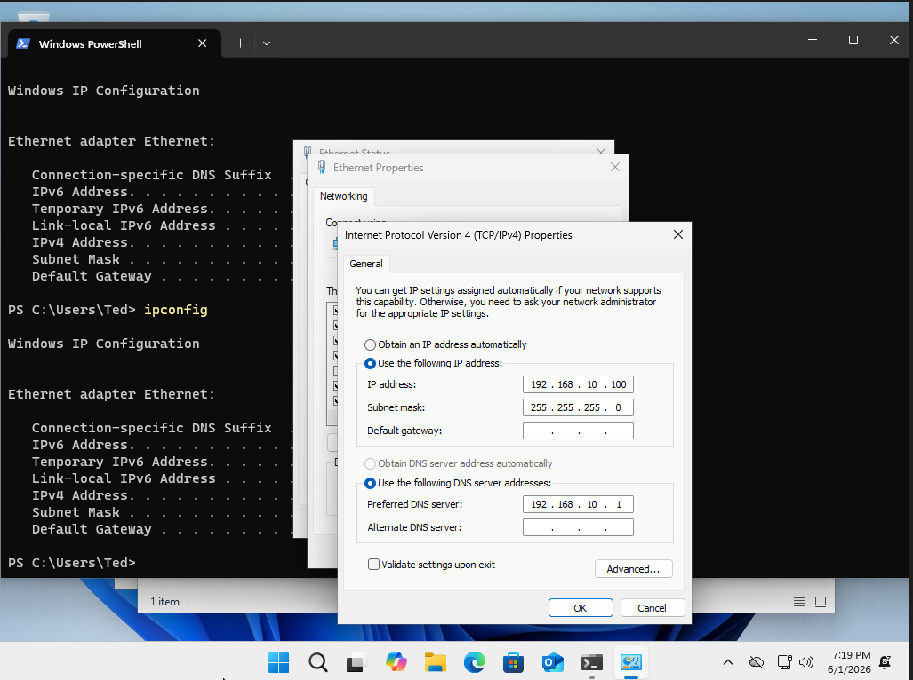
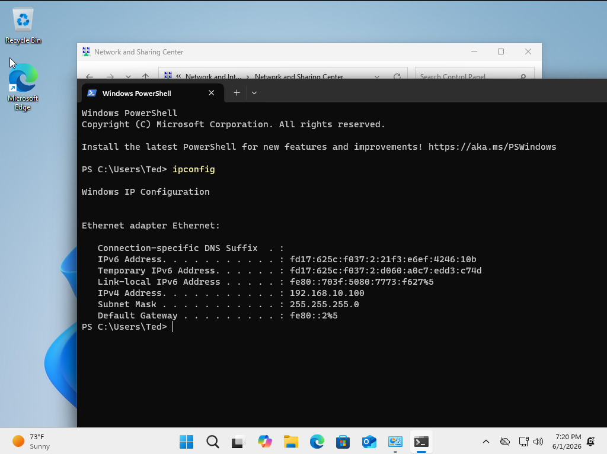
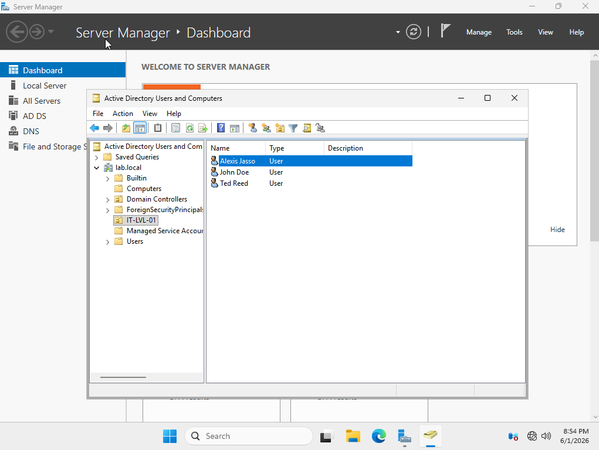
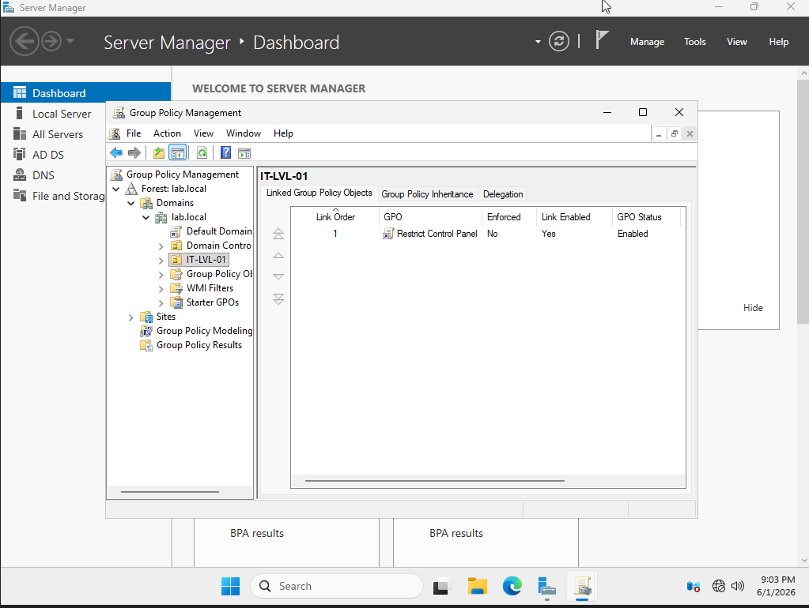
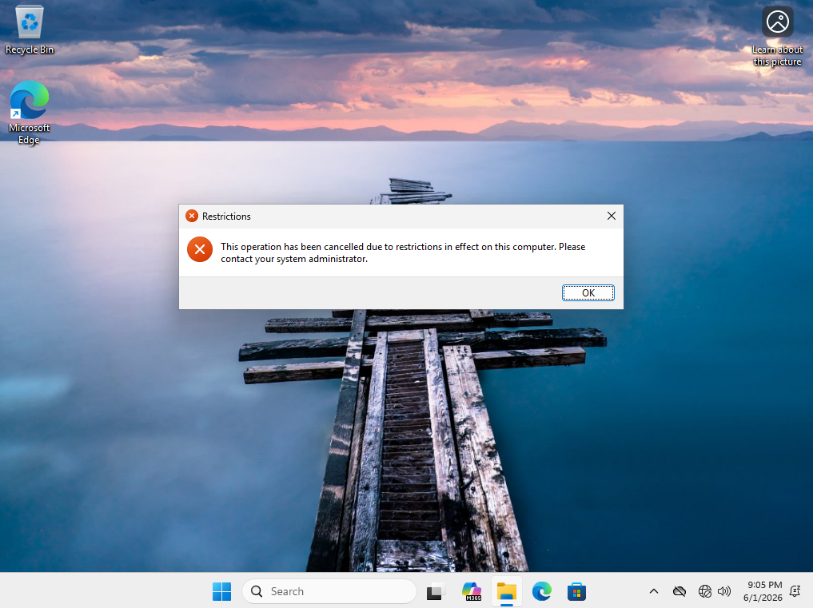

# Active Directory Home Lab — Windows Server 2025 / VirtualBox / Windows 11

## Lab Summary
Built a fully functional Active Directory environment on a personal desktop using VirtualBox to gain hands-on experience with real-world IT administration concepts including domain management, user and group organization, and Group Policy enforcement.

## Hardware Used


- Personal Desktop PC
  - Hosted both VMs through VirtualBox
  - Ran Windows Server 2025 as Domain Controller
  - Ran Windows 11 as domain-joined client machine

## Software & Tools


- VirtualBox — desktop hypervisor hosting both VMs
- Windows Server 2025 — Domain Controller, AD DS, DNS, GPMC
- Windows 11 — domain-joined client workstation
- Active Directory Domain Services (AD DS) — user and domain management
- Group Policy Management Console (GPMC) — policy creation and enforcement

## What I Built & Configured

- 🖥️ Deployed Windows Server 2025 as a Domain Controller with a new forest (`lab.local`)
- 🌐 Configured static IPs and DNS on both VMs for domain communication
- 👥 Created an Organizational Unit (`IT-LVL-1`) with multiple domain user accounts
- 🔒 Implemented and verified a Group Policy Object restricting Control Panel access
- 💻 Joined a Windows 11 client machine to the domain and authenticated as a domain user

---

## 🔧 Step-by-Step Walkthrough

### Step 1 — Configure Static IP & Loopback DNS on the Domain Controller

Before promoting the server to a Domain Controller, a static IP and loopback DNS address were configured on the network adapter to ensure stable communication across the lab network.

| Setting | Value |
|--------|-------|
| IP Address | `192.168.10.1` |
| Subnet Mask | `255.255.255.0` |
| DNS | `127.0.0.1` (loopback) |


---

### Step 2 — Verify Static IP via Command Prompt

After configuring the adapter settings, `ipconfig` was run to confirm the static IP was correctly applied before proceeding.

```bash
ipconfig
```


---

### Step 3 — Install Active Directory Domain Services

AD DS was installed through Server Manager and the server was promoted to a Domain Controller by adding a new forest.

**Steps taken:**
1. Server Manager → Manage → Add Roles and Features
2. Selected **Active Directory Domain Services**
3. Clicked the flag notification → **Promote this server to a domain controller**
4. Selected **Add a new forest** → domain name: `lab.local`
5. Set DSRM password → completed wizard → server rebooted as DC


---

### Step 4 — Create the Windows 11 Client VM

A second VM was created in VirtualBox to serve as the client workstation that would be joined to the domain.

| Setting | Value |
|--------|-------|
| OS | Windows 11 |
| CPU | 2 cores |
| RAM | 2048 MB |
| Disk | 40GB |


---

### Step 5 — Identify Missing Static IP on Client Machine

After booting the client VM, `ipconfig` revealed no static IP had been assigned. Without a static IP and the correct DNS pointing to the DC, the client would not be able to locate or join the domain.


---

### Step 6 — Configure Static IP on Client VM

A static IP was manually configured on the client with the Domain Controller set as the DNS server.

| Setting | Value |
|--------|-------|
| IP Address | `192.168.10.100` |
| Subnet Mask | `255.255.255.0` |
| Preferred DNS | `192.168.10.1` (Domain Controller) |



---

### Step 7 — Verify Client Static IP via Command Prompt

```bash
ipconfig
```



---

### Step 8 — 🛠️ Troubleshooting: Client Could Not Ping the Domain Controller

**❌ Problem:** After configuring static IPs on both machines, pinging the DC from the client returned no packets.

**🔍 Root Cause:** Both VMs were not set to the same network adapter type in VirtualBox. Without both adapters set to **Internal Network** with the same network name, the VMs had no way to reach each other.

**✅ Fix:**
1. Powered off both VMs
2. VirtualBox → Settings → Network → Adapter 1
3. Set **Attached to: Internal Network** on both VMs
4. Named both adapters `adlab`
5. Rebooted both VMs — ping succeeded

> 📸 No image captured for this step — issue was resolved during troubleshooting

---

### Step 9 — 🛠️ Troubleshooting: Password Complexity Error When Adding Users

**❌ Problem:** When adding users to the `IT-LVL-1` OU the following error appeared:

> *"The password does not meet the password policy requirements."*

**🔍 Root Cause:** Windows Server 2025 enforces password complexity by default — requiring uppercase, lowercase, numbers, and special characters.

**✅ Fix:**
1. Server Manager → Tools → Group Policy Management
2. Default Domain Policy → right-click → **Edit**
3. Navigated to: `Computer Configuration → Policies → Windows Settings → Security Settings → Account Policies → Password Policy`
4. Set **Password must meet complexity requirements** → **Disabled**
5. Ran `gpupdate /force` on the server
6. Successfully created users after policy refreshed


---

### Step 10 — Create Users in the IT-LVL-1 Organizational Unit

Three domain user accounts were created inside the `IT-LVL-1` OU with **"User must change password at next logon"** enabled — mirroring real enterprise onboarding procedures.

**Users Created:**
- `Alexis Jasso`
- `John Doe`
- `Ted Reed`



---

### Step 11 — Implement GPO to Restrict Control Panel Access

A Group Policy Object was created and linked to the `IT-LVL-1` OU to block users from accessing the Control Panel — simulating a real-world scenario where standard users are restricted from modifying system settings.

**Steps taken:**
1. Group Policy Management → right-click `IT-LVL-1` → **Create a GPO and Link it here**
2. Named it `Restrict Control Panel`
3. Navigated to: `User Configuration → Policies → Administrative Templates → Control Panel`
4. Set **Prohibit access to Control Panel and PC Settings** → **Enabled**
5. Ran `gpupdate /force` on the client to apply immediately



---

### Step 12 — Verify GPO — Control Panel Blocked on Client Machine

Logged into the Windows 11 client using a domain user account from the `IT-LVL-1` OU and attempted to open Control Panel — access was denied confirming the GPO was working end to end.

```
Alexis
```



---

## ✅ Lab Completion Summary

| Task | Status |
|------|--------|
| Domain Controller configured with static IP | ✅ |
| AD DS installed and domain promoted | ✅ |
| Client VM joined to domain | ✅ |
| Organizational Unit created with users | ✅ |
| Group Policy Object created and applied | ✅ |
| GPO verified on client machine | ✅ |

---

## 🛠️ Troubleshooting & Challenges

### VirtualBox Internal Network Adapter Mismatch
- Both VMs must use the same Internal Network name or they cannot communicate regardless of IP configuration
- Resolved by setting both adapters to **Internal Network → `adlab`** in VirtualBox settings

### Password Complexity Policy Blocking User Creation
- Windows Server 2025 enforces complexity requirements by default
- Temporarily disabled via Default Domain Policy → Password Policy in Group Policy Management Editor
- Ran `gpupdate /force` on the server to apply the change immediately

### Display Black Screen on Boot (Windows Server 2025)
- VirtualBox defaulted to an incompatible graphics controller
- Resolved by switching to **VMSVGA**, disabling **3D Acceleration**, and setting video memory to **128 MB** in Display settings

---

## 📚 What I Learned

Gained practical understanding of how enterprise identity and access management works — how users are organized through OUs, how Group Policy enforces security controls at scale, and how domain authentication flows between a client and a Domain Controller. Troubleshooting real issues like network adapter mismatches, DNS dependency for domain joining, and Group Policy propagation gave me hands-on experience that directly maps to Help Desk, IT Support, and junior cybersecurity roles.
